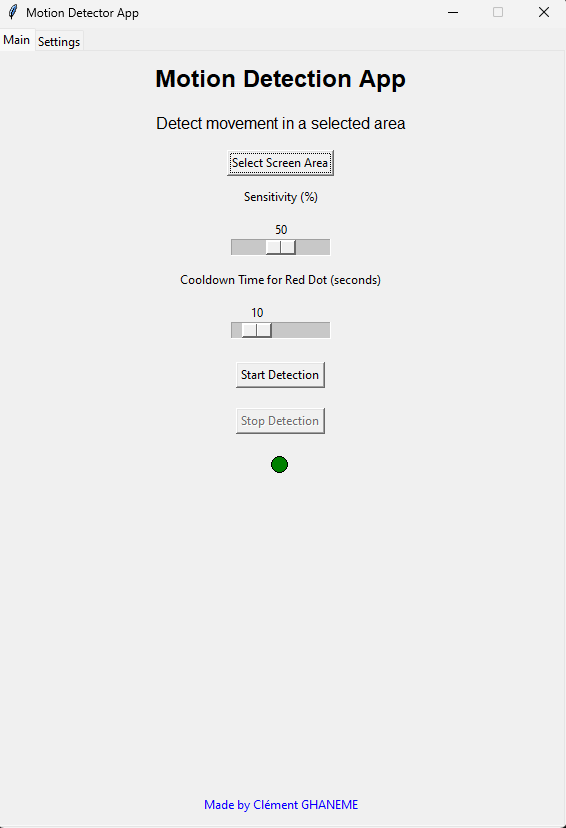
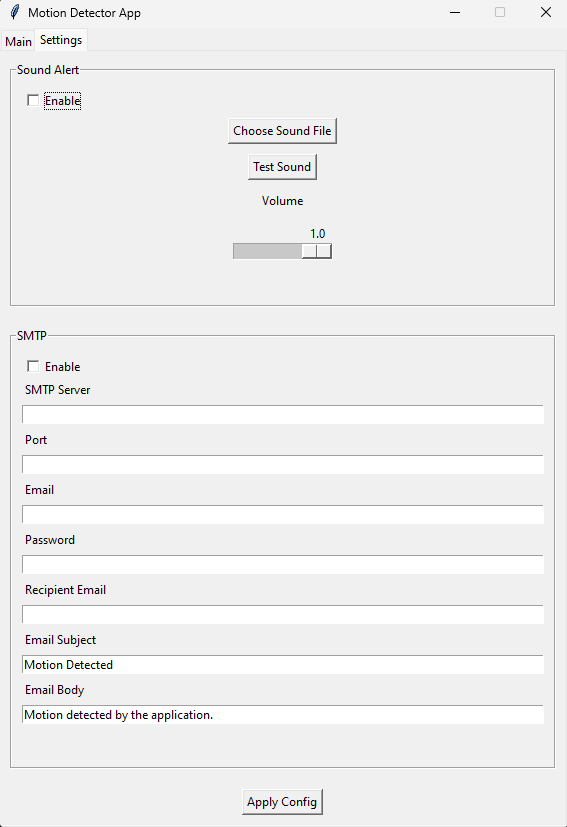

# MotionGuard
Intelligent Screen Area Motion Detection

Clément GHANEME - 2024/09

# MotionGuard: Intelligent Screen Area Motion Detection

MotionGuard is a Python application that allows users to select a specific area of their screen to monitor for motion. Once motion is detected, the app can trigger various actions such as playing a sound, sending email notifications, and displaying alerts in the user interface. With adjustable sensitivity, this app offers real-time motion detection and can be used for surveillance, activity monitoring, or other creative applications.

## Screenshot - CSV Formatting





## Technologies Used

### 1. **Python**
   The core of the application is built using Python, leveraging various libraries for UI, image processing, and multimedia handling.

### 2. **Tkinter (GUI)**
   Tkinter is used to build the graphical user interface (GUI). It provides the layout for interacting with the application, including buttons for selecting areas, starting/stopping motion detection, and configuring settings. The GUI also displays the application's real-time status and visual feedback for motion detection.

### 3. **Pillow (Image Processing)**
   Pillow (Python Imaging Library) is used to take screenshots of the screen and allow users to define specific regions for motion detection. This library enables capturing and manipulating images in various formats.

### 4. **OpenCV (Motion Detection)**
   OpenCV is used for image processing and motion detection. It captures frames from the specified screen region and compares them to detect movement by calculating differences between consecutive frames.

### 5. **Pygame (Sound Playback)**
   Pygame is employed to handle sound playback. When motion is detected, a custom sound file can be played, with volume control, using the Pygame mixer module. Pygame ensures cross-platform compatibility for audio playback.

### 6. **smtplib (Email Alerts)**
   The built-in Python `smtplib` library is used for sending email alerts when motion is detected. Users can configure SMTP settings within the app, including server, port, credentials, and recipient details.

### 7. **ConfigParser (Settings Management)**
   ConfigParser is used to store and retrieve application settings such as the sensitivity, SMTP configurations, sound file location, and volume settings. These settings are saved to an `.ini` file and loaded automatically when the app is restarted.

## How It Works

### 1. **Select Screen Area**
   Users can select a specific area of the screen to monitor for motion. The app captures a screenshot of the full screen, and the user draws a rectangle to define the area to be monitored.

### 2. **Motion Detection**
   Once the area is selected, OpenCV continuously captures frames from that region and compares them to detect changes. The app uses an adjustable sensitivity slider to control how sensitive the detection is to minor movements.

### 3. **Sound Alerts**
   If enabled, when motion is detected, a custom sound file is played using the Pygame library. The sound will only play if no other sound is currently playing, preventing overlap. A volume slider in the settings tab allows users to adjust the playback volume.

### 4. **Email Notifications**
   Users can configure email alerts via SMTP. Once motion is detected, the app sends an email to a predefined recipient with the subject and body text defined by the user. This feature is useful for real-time alerts.

### 5. **Real-Time Status Indicator**
   A visual indicator shows the current status of the motion detection. A green circle indicates no motion, while a red circle indicates motion has been detected. The red indicator remains for 10 seconds after the motion stops to ensure visibility.

### 6. **Settings Persistence**
   All configurations, including SMTP settings, sound settings, and sensitivity levels, are saved using the ConfigParser library. The app will load these settings automatically on startup, ensuring that users don't need to reconfigure the app each time they run it.

## Features

```
Detects motion within a user-selected screen area.
Adjustable sensitivity for motion detection via slider.
Visual motion indicator with red for detected motion and green for no motion.
Cooldown period for motion indicator with adjustable time (1-60 seconds).
Plays a custom sound alert on motion detection with volume control.
Sends email notifications when motion is detected using SMTP settings.
Supports SSL (port 465) and TLS (port 587) email connections.
Allows selection of a custom screen area using a screenshot-based interface.
Start and stop buttons to control motion detection.
Customizable SMTP settings for server, port, sender, and recipient email.
Error logging for issues with motion detection, email, and sound.
Fixed-size graphical user interface (570x800) using Tkinter.
Test sound functionality to verify sound playback.
```

## Installation (Deprecated now automatic with subprocess)

To install the necessary dependencies, use the following commands:

```bash
pip install opencv-python Pillow pygame
